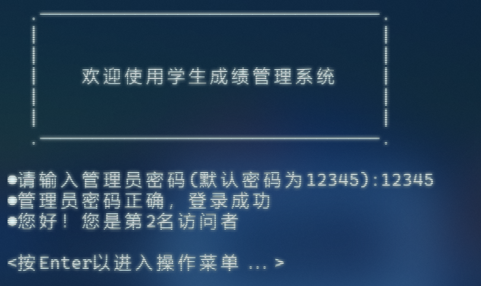
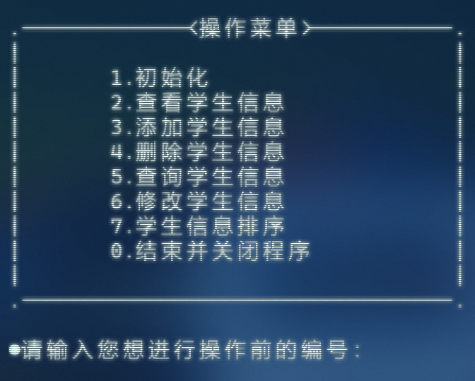
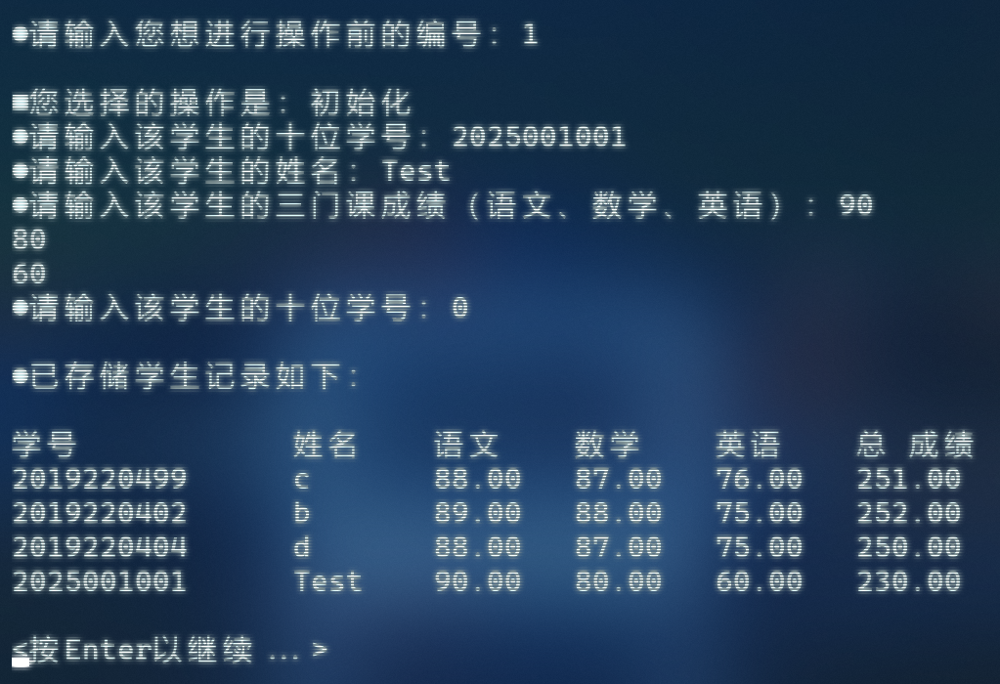
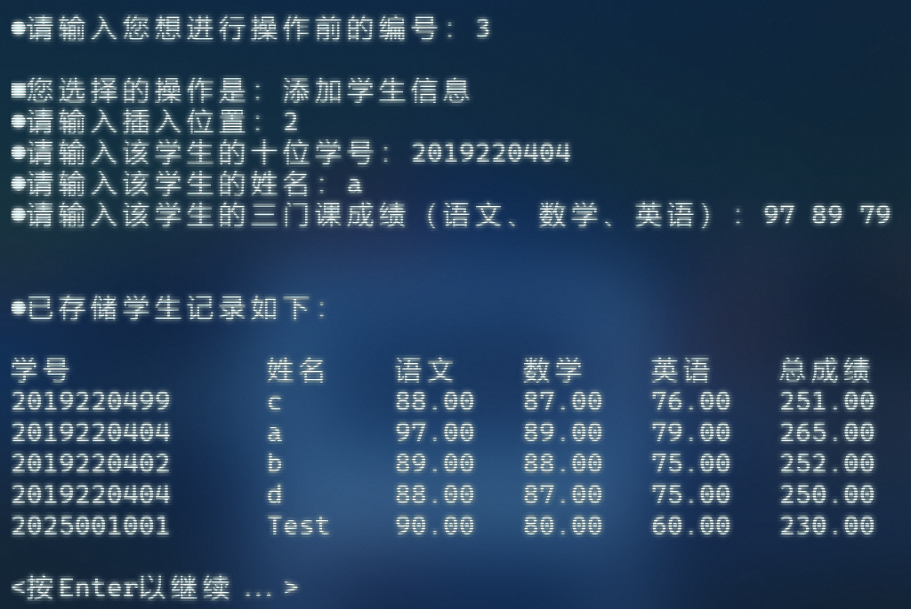
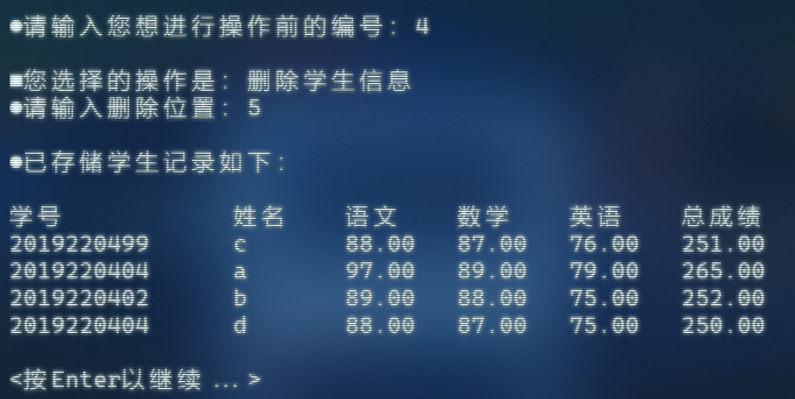
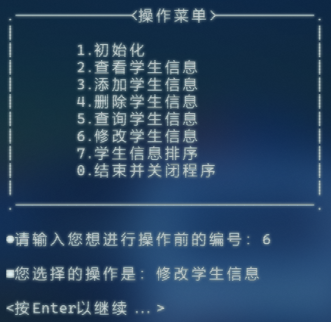
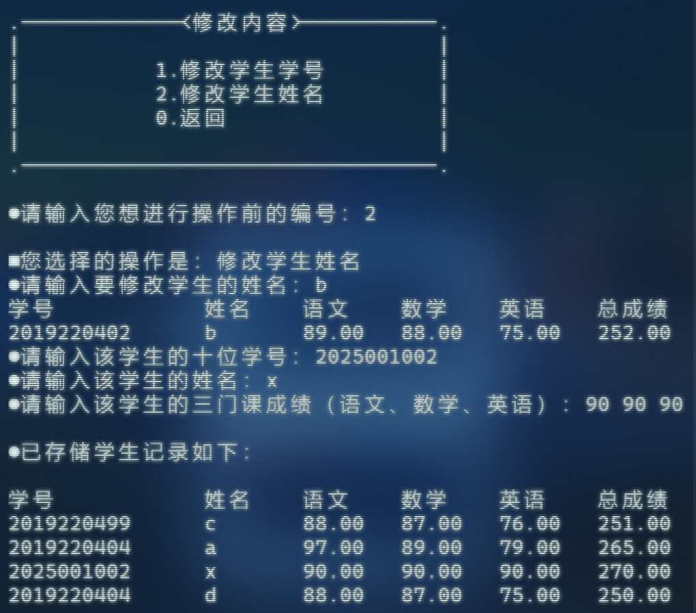
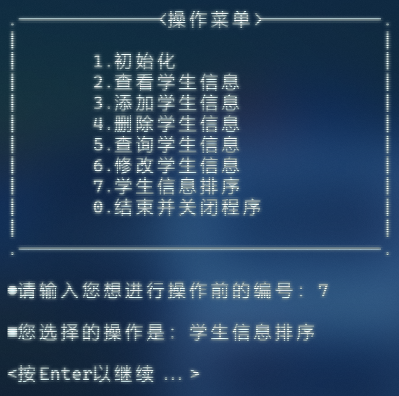
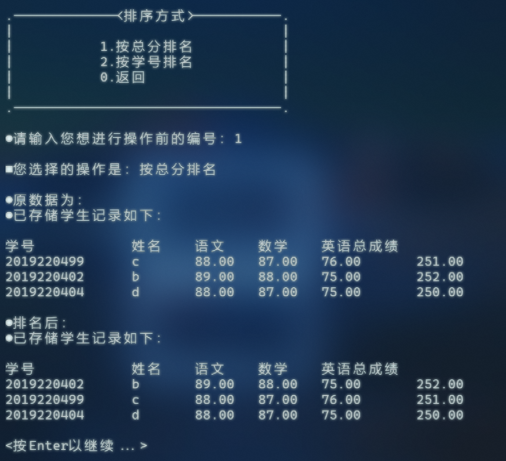
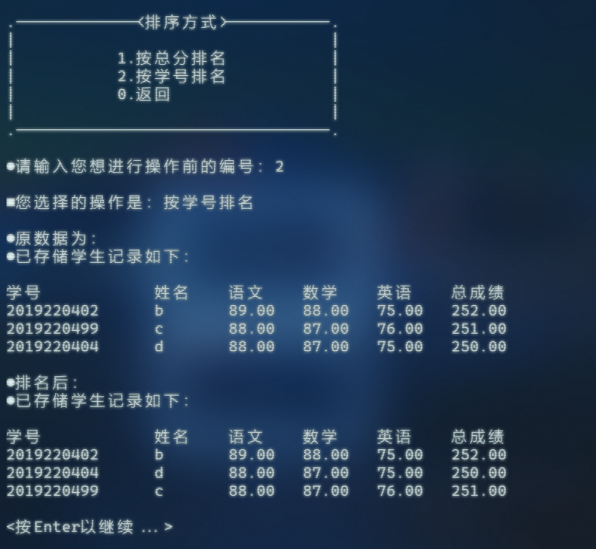

# 基于C语言的学生成绩管理系统
# Student Achievement Management System Based on C

## 1. 说明 Description

这是一个完全基于**C语言**的学生成绩管理系统，项目完成时间为2019年。该项目是C语言课程大学作业，只完成了很基础的增删改查功能。该项目遵循GPL开源协议，可进行二次开发修改。

This is a student grade management system completely based on **C language**. The project was completed in 2019. This project is a university assignment for the C language course, and only very basic functions of addition, deletion, modification, and query have been completed. This project follows the GPL open-source protocol and can be further developed and modified.  

**运行环境**： 推荐集成开发环境为Microsoft Visual Studio Professional 2022 (64 位)，推荐版本 17.12.3。

**Operating Environment**: The recommended IDE is Microsoft Visual Studio Professional 2022 (64-bit), with the recommended version being 17.12.3.

## 2. 预览 Preview

以下为基于C语言的学生成绩管理系统项目预览：

The following is a preview of the student grade management system project based on C language:

#### 2.1 系统登录 System Login

输入默认密码即可登录系统进入操作菜单。

Enter the default password to log in to the system and enter the operation menu.



### 2.2 操作菜单 Operation Menu

系统共有8类操作，输入操作前编号即可进入相应操作功能。

The system has 8 types of operations, and entering the corresponding operation function by entering the pre operation number.



### 2.3 初始化 Initialization

在操作菜单中输入1即可进入初始化功能，输入学生的10位学号、姓名以及课程成绩即可录入，直至输入学号为0结束录入并显示已存储的学生记录。

Enter 1 in the operation menu to enter the initialization function. Enter the student's 10 digit student ID, name, and course grade to enter until the student ID is 0. End the entry and display the stored student records.



### 2.4 查看学生信息 View Student Information

在操作菜单中输入2即可查看学生信息，输入学生的10位学号、姓名以及课程成绩即可录入，直至输入学号为0结束录入并显示已存储的学生记录。

Enter 2 in the operation menu to view student information. Enter the student's 10 digit student ID, name, and course grade to enter until the student ID is 0. End the entry and display the stored student records.


### 2.5 添加学生信息 Add Student Information

在操作菜单中输入3即可添加学生信息，与初始化不同的是添加学生信息可指定插入位置，在 `add` 函数中实现添加学生信息功能时，用到了以下核心代码：

Enter 3 in the operation menu to add student information. Unlike initialization, adding student information can specify the insertion position. When implementing the `add` function to add student information, the following core code is used:

```c
for(i = len; i >= n; i--)
    stu[i] = stu[i-1]; 
```

这里使用了一个循环，将从插入位置 `n` 开始到数组末尾的所有元素，依次向后移动一个位置。

Here, a loop is used to move all the elements from the insertion position `n` to the end of the array one position backward in sequence. 



### 2.6 删除学生信息 Delete Student Information

在操作菜单中输入4即可添加学生信息，指定位置进行删除，核心算法是通过数组元素覆盖来实现删除功能，代码如下：

Enter 4 in the operation menu to add student information, and specify the location for deletion. The core algorithm is to achieve the deletion function by overwriting array elements. The code is as follows:

```c
for(i = n; i < len; i++)
    stu[i - 1]=stu[i]; 
len--;
```



### 2.7 修改学生信息 Modify Student Information

在操作菜单中输入6即可添加学生信息，随后进入修改内容菜单。

Enter 6 in the operation menu to add student information, and then enter the modify content menu.



在修改内容菜单下，输入2可修改学生姓名，依次输入修改信息后，覆盖原信息并显示已存储的学生记录。

Under the modify content menu, enter 2 to modify the student name. After entering the modified information in sequence, overwrite the original information and display the stored student records.



### 2.8 学生信息排序 Sorting of Student Information

在操作菜单中输入7即可进行学生信息排序，随后进入排序方式菜单。

Enter 7 in the operation menu to sort student information, and then enter the sorting method menu.



在排序方式菜单下，输入1可按总分排名，使用了冒泡排序算法，代码如下：

Under the sorting method menu, enter 1 to rank by total score, using the bubble sorting algorithm. The code is as follows:

```c
for(i = 1; i < len; i++)
    for(j = 0; j < len - i; j++)
        if(stu[j].total < stu[j + 1].total)
        {
            stu[49]=stu[j];
            stu[j]=stu[j + 1];
            stu[j + 1]=stu[49];
        }
```



在排序方式菜单下，输入2可按学号排名，使用了冒泡排序算法，代码如下：

Under the sorting method menu, enter 2 to rank by student ID, using the bubble sorting algorithm. The code is as follows:

```c
for(i = 1; i < len; i++)
    for(j = 0; j < len - i; j++)
        if(stu[j].num > stu[j + 1].num)
        {
            stu[49]=stu[j];
            stu[j]=stu[j + 1];
            stu[j + 1]=stu[49];
        }
```



## 3. 时间复杂度 Time Complexity

该学生成绩管理系统中，初始化、添加、删除、修改和查询功能的时间复杂度为O(n)，排序功能的时间复杂度为O(n²)。

The time complexity of initialization, addition, deletion, modification, and query functions in the student performance management system is O (n), and the time complexity of sorting functions is O (n ²).

## 4. 碎碎念 Meaningless Words

这个系统是我做的第一个较为完整的基础系统，很简单，也很有意义。它有很多不足，比如在数据处理和用户交互方面存在着明显的缺陷。从数据处理角度来看，数据的存储方式过于简单和原始。在用户交互方面，系统的界面设计非常简陋，缺乏友好性和易用性。此外，系统的扩展性和维护性也较差。但它开启了我的编程之旅和大学生涯，它让我对程序设计和软件开发有了更深入的理解，我学会了如何分析问题、设计解决方案，并将其转化为实际的代码。诸多不足敬请谅解，谨以此项目献于我的第一堂计算机启蒙课。😽

This system is the first relatively complete basic system I've developed. It is simple yet meaningful. However, it has many drawbacks. For example, there are obvious deficiencies in data processing and user interaction. From the perspective of data processing, the data storage method is overly simple and primitive. In terms of user interaction, the system's interface design is extremely plain and lacks friendliness and usability. Additionally, the system has poor expandability and maintainability. Nonetheless, it has launched my programming journey and college life. It has enabled me to gain a deeper understanding of programming design and software development. I've learned how to analyze problems, design solutions, and translate them into actual code. Please forgive the numerous imperfections. I hereby dedicate this project to my first computer enlightenment course. 😽 
